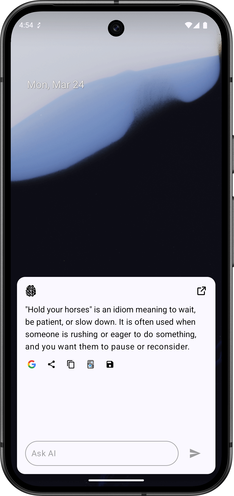
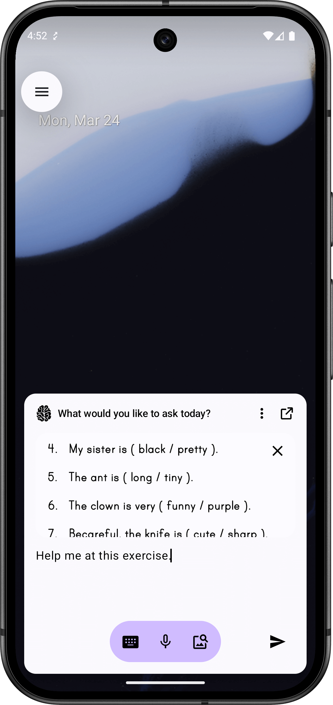
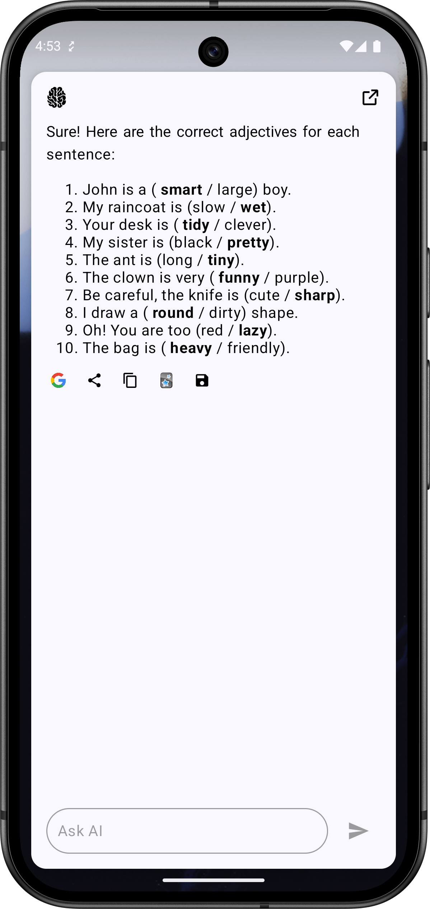

# AiDict

AiDict is an AI-powered dictionary designed to streamline language learning by providing
comprehensive word and phrase explanations instantly. Unlike traditional dictionaries that require
searching multiple sources manually, AiDict consolidates relevant information automatically and
integrates seamlessly into your workflow.

## 📦 Download

Click the button below to download the latest version of the app:

## 🚀 Why AiDict?

While AI chatbots can provide detailed word explanations, they require switching contexts, manual
copying, and additional time. AiDict eliminates these friction points, offering:

- **One-click word lookup**: Get detailed word meanings, synonyms, antonyms, collocations, example
  sentences, and etymology in one place.
- **Seamless Anki Integration**: Automatically format and export word explanations to Anki for
  efficient spaced repetition learning.
- **AI-powered insights**: Uses AI models in combination with trusted dictionaries to provide the
  most accurate and comprehensive results.

## 🎯 Project Goal

AiDict is a personal open-source project aimed at optimizing the English learning experience by
reducing time-consuming actions. It is not designed for commercial purposes but rather to address a
personal need. **No one is allowed to use this project for commercial purposes.**

## 🛠️ Tech Stack

### 📱 Android Framework

- **Language**: Kotlin (with Coroutines for asynchronous tasks)
- **UI Framework**: Jetpack Compose (for modern declarative UI)
- **Database**: Room DB (for temporary card storage)
- **Preferences Management**: Data Store (for storing user settings and preferences)
- **Design System**: Material 3 (for a modern and accessible UI)
- **Rich Text Editing**: [Compose Rich Editor](https://github.com/MohamedRejeb/compose-rich-editor) (for advanced text
  input and formatting)
- **Image Loading**: Coil (for efficient image handling)
- **Dependency Injection**: Koin (for managing dependencies in a lightweight way)

### 🤖 AI Integration

- **AI Services**: OpenAI & DeepSeek (for intelligent word analysis and definitions)

## 📌 Features

- 🔍 **Instant Word Lookups**: AI-powered search for definitions, synonyms, antonyms, example usage,
  and pronunciation.
- 📊 **Anki Export**: Automatically formats AI responses into Anki flashcards.
- 🔧 **Configurable AI Settings**: Choose between different AI models for cost-efficiency.

## 🏗️ Development Status

Currently, AiDict is in its early development phase. The project was initially built using Gemini AI
but is being transitioned to OpenAI and DeepSeek for better customization and efficiency.

## 📸 Screenshots

| Ask                                  | Answer                                  | Ask with Image                             | Answer with Image                             |
|--------------------------------------|-----------------------------------------|--------------------------------------------|-----------------------------------------------|
|  |  |  |  |

## 🔮 Future Plans

- 🔄 **~~Complete transformation from Gemini to OpenAI and DeepSeek~~** (Done)
- 💰 **Utilize OpenAI batch service to reduce costs**
- 🔗 **Integrate sources and search functionality for more accurate AI results**
- 🎯 **Fine-tune AI models to save tokens and improve accuracy**
- 📂 **Import and process words from a CSV file**
- 🎤 **Implement speech-to-text service**
- 🔊 **Read answers aloud for better pronunciation learning**
- 🔍 **Add AI search feature to the home screen**

## 🤝 Contribution

Although this is primarily a personal project, contributions, feedback, and discussions are always
welcome. Feel free to explore, fork, and improve the repository!

## 📜 License

This project is [source-available, non-commercial license based on MIT](LICENSE).

## 🧾 Contributor License Agreement (CLA)

By submitting code, ideas, or documentation to this repository, you agree that:

- Your contributions are provided under the same license as this project (MIT + Non-Commercial).
- You grant the project maintainer full rights to use, modify, and distribute your contributions as
  part of the project, under the project’s existing license.

---

### ⚠️ Disclaimer

This project is a work in progress and is focused on functionality rather than perfection. While I
strive to follow best practices, there is always room for improvement. If you notice areas that
could be enhanced, feel free to contribute—I truly appreciate the effort! My main goal is to develop
this app efficiently and improve my language learning experience along the way. Thank you for your
support and happy coding! 😃

